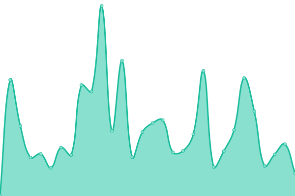

# [📈 Live Status](https://status.skk.moe): <!--live status--> **🟥 Complete outage**

This repository contains the open-source uptime monitor and status page for [Sukka's Lab](https://lab.skk.moe), powered by [Upptime](https://github.com/upptime/upptime).

With [Upptime](https://upptime.js.org), you can get your own unlimited and free uptime monitor and status page, powered entirely by a GitHub repository. We use [Issues](https://github.com/SukkaLab/status.skk.moe/issues) as incident reports, [Actions](https://github.com/SukkaLab/status.skk.moe/actions) as uptime monitors, and [Pages](https://status.skk.moe) for the status page.

<!--start: status pages-->
<!-- This summary is generated by Upptime (https://github.com/upptime/upptime) -->
<!-- Do not edit this manually, your changes will be overwritten -->
<!-- prettier-ignore -->
| URL | Status | History | Response Time | Uptime |
| --- | ------ | ------- | ------------- | ------ |
|  [skk.moe](https://skk.moe) | 🟥 Down | [skk-moe.yml](https://github.com/SukkaLab/status.skk.moe/commits/HEAD/history/skk-moe.yml) | 

 40ms
     
 | 

<a href="https://status.skk.moe/history/skk-moe">4.93%</a>
    

|  [www.skk.moe](https://www.skk.moe) | 🟥 Down | [www-skk-moe.yml](https://github.com/SukkaLab/status.skk.moe/commits/HEAD/history/www-skk-moe.yml) | 

 37ms
     
 | 

<a href="https://status.skk.moe/history/www-skk-moe">0.00%</a>
    

|  [blog.skk.moe](https://blog.skk.moe) | 🟥 Down | [blog-skk-moe.yml](https://github.com/SukkaLab/status.skk.moe/commits/HEAD/history/blog-skk-moe.yml) | 

 43ms
     
 | 

<a href="https://status.skk.moe/history/blog-skk-moe">13.17%</a>
    

|  [cdn.skk.moe](https://cdn.skk.moe) | 🟥 Down | [cdn-skk-moe.yml](https://github.com/SukkaLab/status.skk.moe/commits/HEAD/history/cdn-skk-moe.yml) | 

 108ms
     
 | 

<a href="https://status.skk.moe/history/cdn-skk-moe">0.00%</a>
    

<!--end: status pages-->

[**Visit our status website →**](https://status.skk.moe)

## 📄 License

- Powered by: [Upptime](https://github.com/upptime/upptime)
- Code: [MIT](./LICENSE) © [Sukka's Lab](https://lab.skk.moe)
- Data in the `./history` directory: [Open Database License](https://opendatacommons.org/licenses/odbl/1-0/)
