# [📈 Live Status](https://status.skk.moe): <!--live status--> **🟩 All systems operational**

This repository contains the open-source uptime monitor and status page for [Sukka's Lab](https://lab.skk.moe), powered by [Upptime](https://github.com/upptime/upptime).

With [Upptime](https://upptime.js.org), you can get your own unlimited and free uptime monitor and status page, powered entirely by a GitHub repository. We use [Issues](https://github.com/SukkaLab/status.skk.moe/issues) as incident reports, [Actions](https://github.com/SukkaLab/status.skk.moe/actions) as uptime monitors, and [Pages](https://status.skk.moe) for the status page.

<!--start: status pages-->
<!-- This summary is generated by Upptime (https://github.com/upptime/upptime) -->
<!-- Do not edit this manually, your changes will be overwritten -->
<!-- prettier-ignore -->
| URL | Status | History | Response Time | Uptime |
| --- | ------ | ------- | ------------- | ------ |
|  [skk.moe](https://skk.moe) | 🟩 Up | [skk-moe.yml](https://github.com/SukkaLab/status.skk.moe/commits/HEAD/history/skk-moe.yml) | 

 205ms
     
 | 

<a href="https://status.skk.moe/history/skk-moe">100.00%</a>
    

|  [www.skk.moe](https://www.skk.moe) | 🟩 Up | [www-skk-moe.yml](https://github.com/SukkaLab/status.skk.moe/commits/HEAD/history/www-skk-moe.yml) | 

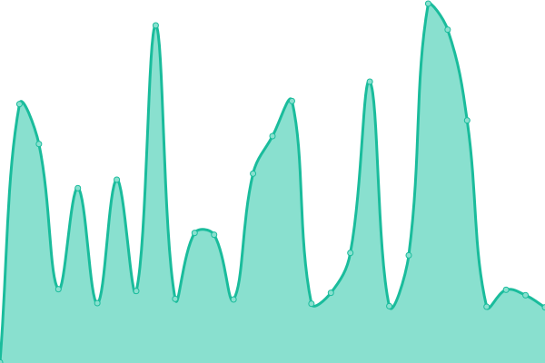 197ms
     
 | 

<a href="https://status.skk.moe/history/www-skk-moe">100.00%</a>
    

|  [blog.skk.moe](https://blog.skk.moe) | 🟩 Up | [blog-skk-moe.yml](https://github.com/SukkaLab/status.skk.moe/commits/HEAD/history/blog-skk-moe.yml) | 

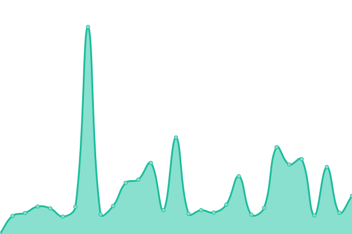 208ms
     
 | 

<a href="https://status.skk.moe/history/blog-skk-moe">100.00%</a>
    

|  [ip.skk.moe](https://ip.skk.moe) | 🟩 Up | [ip-skk-moe.yml](https://github.com/SukkaLab/status.skk.moe/commits/HEAD/history/ip-skk-moe.yml) | 

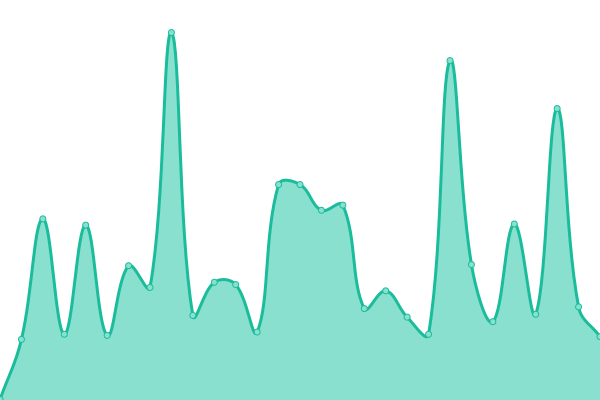 173ms
     
 | 

<a href="https://status.skk.moe/history/ip-skk-moe">100.00%</a>
    

|  [lab.skk.moe](https://lab.skk.moe) | 🟩 Up | [lab-skk-moe.yml](https://github.com/SukkaLab/status.skk.moe/commits/HEAD/history/lab-skk-moe.yml) | 

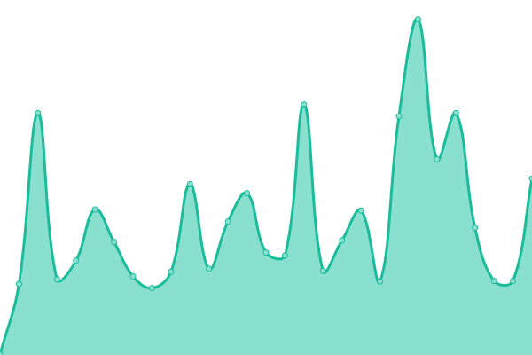 169ms
     
 | 

<a href="https://status.skk.moe/history/lab-skk-moe">100.00%</a>
    

|  [friends.cdn.skk.moe](https://friends.cdn.skk.moe/links.json) | 🟩 Up | [friends-cdn-skk-moe.yml](https://github.com/SukkaLab/status.skk.moe/commits/HEAD/history/friends-cdn-skk-moe.yml) | 

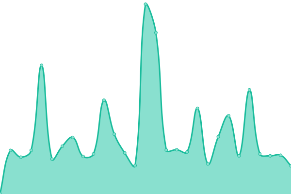 170ms
     
 | 

<a href="https://status.skk.moe/history/friends-cdn-skk-moe">100.00%</a>
    

|  [cdn.skk.moe](https://cdn.skk.moe) | 🟩 Up | [cdn-skk-moe.yml](https://github.com/SukkaLab/status.skk.moe/commits/HEAD/history/cdn-skk-moe.yml) | 

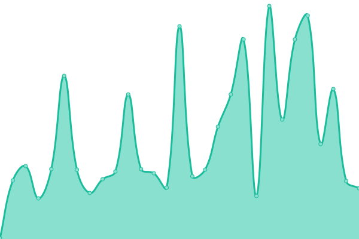 148ms
     
 | 

<a href="https://status.skk.moe/history/cdn-skk-moe">100.00%</a>
    

|  [pic.skk.moe](https://pic.skk.moe) | 🟩 Up | [pic-skk-moe.yml](https://github.com/SukkaLab/status.skk.moe/commits/HEAD/history/pic-skk-moe.yml) | 

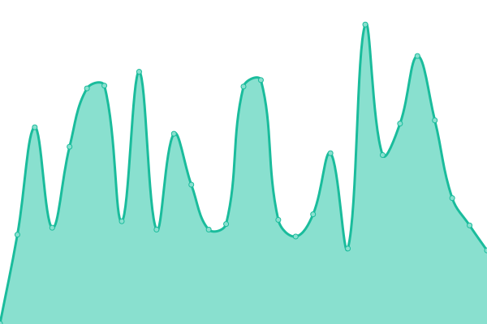 216ms
     
 | 

<a href="https://status.skk.moe/history/pic-skk-moe">100.00%</a>
    

|  [img.skk.moe](https://img.skk.moe) | 🟩 Up | [img-skk-moe.yml](https://github.com/SukkaLab/status.skk.moe/commits/HEAD/history/img-skk-moe.yml) | 

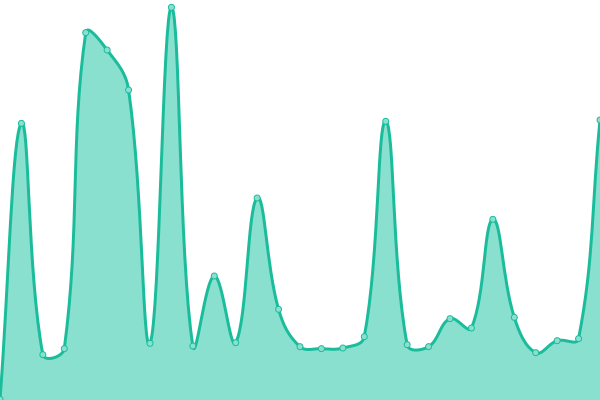 137ms
     
 | 

<a href="https://status.skk.moe/history/img-skk-moe">100.00%</a>
    

|  [go.skk.moe](https://go.skk.moe) | 🟩 Up | [go-skk-moe.yml](https://github.com/SukkaLab/status.skk.moe/commits/HEAD/history/go-skk-moe.yml) | 

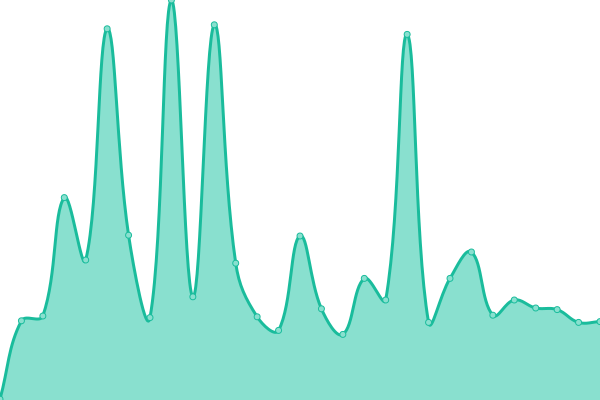 157ms
     
 | 

<a href="https://status.skk.moe/history/go-skk-moe">100.00%</a>
    

|  [foxact.skk.moe](https://foxact.skk.moe) | 🟩 Up | [foxact-skk-moe.yml](https://github.com/SukkaLab/status.skk.moe/commits/HEAD/history/foxact-skk-moe.yml) | 

 167ms
     
 | 

<a href="https://status.skk.moe/history/foxact-skk-moe">100.00%</a>
    

|  [dashflare.skk.moe](https://dashflare.skk.moe) | 🟩 Up | [dashflare-skk-moe.yml](https://github.com/SukkaLab/status.skk.moe/commits/HEAD/history/dashflare-skk-moe.yml) | 

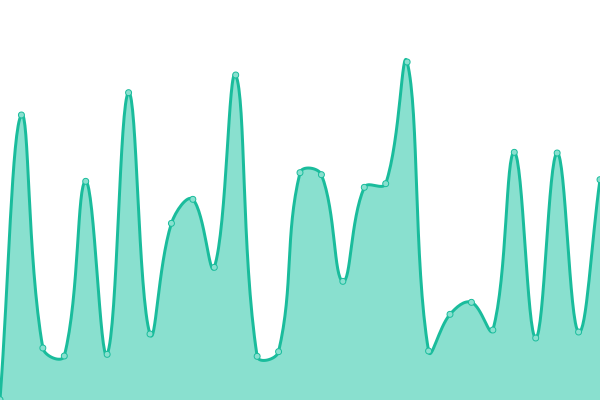 258ms
     
 | 

<a href="https://status.skk.moe/history/dashflare-skk-moe">100.00%</a>
    

|  [vercel-dns.skk.moe](https://vercel-dns.skk.moe) | 🟩 Up | [vercel-dns-skk-moe.yml](https://github.com/SukkaLab/status.skk.moe/commits/HEAD/history/vercel-dns-skk-moe.yml) | 

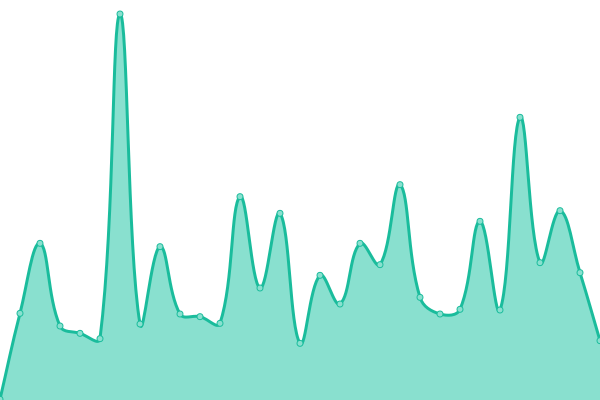 148ms
     
 | 

<a href="https://status.skk.moe/history/vercel-dns-skk-moe">100.00%</a>
    

|  [ruleset.skk.moe](https://ruleset.skk.moe) | 🟩 Up | [ruleset-skk-moe.yml](https://github.com/SukkaLab/status.skk.moe/commits/HEAD/history/ruleset-skk-moe.yml) | 

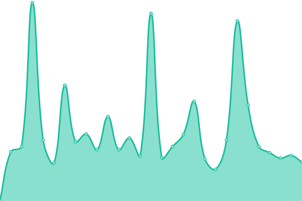 168ms
     
 | 

<a href="https://status.skk.moe/history/ruleset-skk-moe">100.00%</a>
    

|  [latency-test.skk.moe](https://latency-test.skk.moe/endpoint) | 🟩 Up | [latency-test-skk-moe.yml](https://github.com/SukkaLab/status.skk.moe/commits/HEAD/history/latency-test-skk-moe.yml) | 

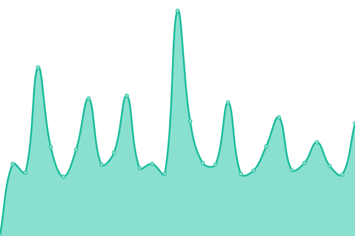 90ms
     
 | 

<a href="https://status.skk.moe/history/latency-test-skk-moe">100.00%</a>
    

|  [latency-test.lab.skk.moe](https://latency-test.skk.moe/endpoint) | 🟩 Up | [latency-test-lab-skk-moe.yml](https://github.com/SukkaLab/status.skk.moe/commits/HEAD/history/latency-test-lab-skk-moe.yml) | 

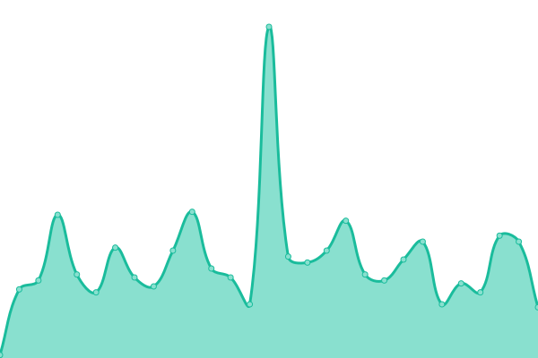 20ms
     
 | 

<a href="https://status.skk.moe/history/latency-test-lab-skk-moe">100.00%</a>
    

|  [disqusjs.skk.moe](https://disqusjs.skk.moe) | 🟩 Up | [disqusjs-skk-moe.yml](https://github.com/SukkaLab/status.skk.moe/commits/HEAD/history/disqusjs-skk-moe.yml) | 

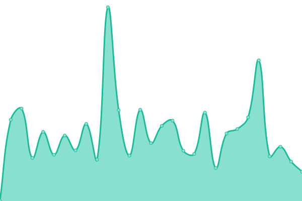 142ms
     
 | 

<a href="https://status.skk.moe/history/disqusjs-skk-moe">100.00%</a>
    

|  [disqus.skk.moe](https://disqus.skk.moe) | 🟩 Up | [disqus-skk-moe.yml](https://github.com/SukkaLab/status.skk.moe/commits/HEAD/history/disqus-skk-moe.yml) | 

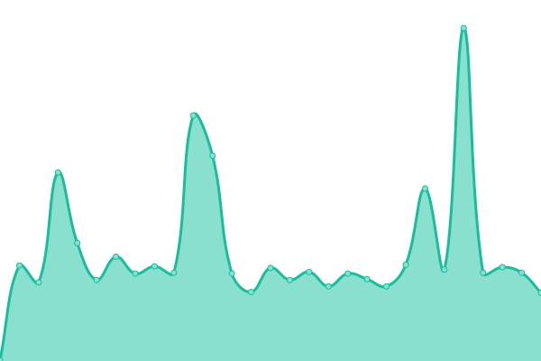 231ms
     
 | 

<a href="https://status.skk.moe/history/disqus-skk-moe">100.00%</a>
    

|  [doku.skk.moe](https://doku.skk.moe) | 🟩 Up | [doku-skk-moe.yml](https://github.com/SukkaLab/status.skk.moe/commits/HEAD/history/doku-skk-moe.yml) | 

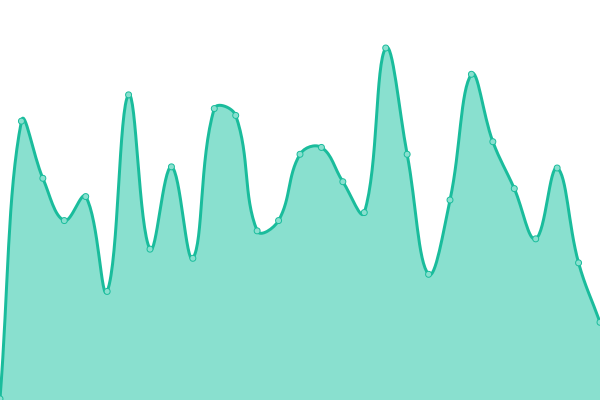 144ms
     
 | 

<a href="https://status.skk.moe/history/doku-skk-moe">100.00%</a>
    

|  [hv-monster.skk.moe](https://hv-monster.skk.moe) | 🟩 Up | [hv-monster-skk-moe.yml](https://github.com/SukkaLab/status.skk.moe/commits/HEAD/history/hv-monster-skk-moe.yml) | 

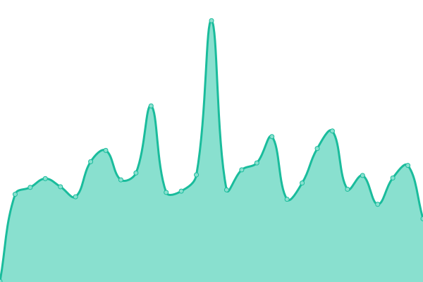 167ms
     
 | 

<a href="https://status.skk.moe/history/hv-monster-skk-moe">100.00%</a>
    

|  [hv-monster-submit.skk.moe](https://hv-monster-submit.skk.moe) | 🟩 Up | [hv-monster-submit-skk-moe.yml](https://github.com/SukkaLab/status.skk.moe/commits/HEAD/history/hv-monster-submit-skk-moe.yml) | 

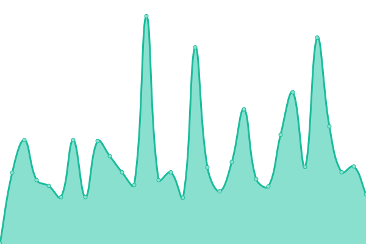 139ms
     
 | 

<a href="https://status.skk.moe/history/hv-monster-submit-skk-moe">100.00%</a>
    

|  [hv-monsterdb-data.skk.moe](https://hv-monsterdb-data.skk.moe) | 🟩 Up | [hv-monsterdb-data-skk-moe.yml](https://github.com/SukkaLab/status.skk.moe/commits/HEAD/history/hv-monsterdb-data-skk-moe.yml) | 

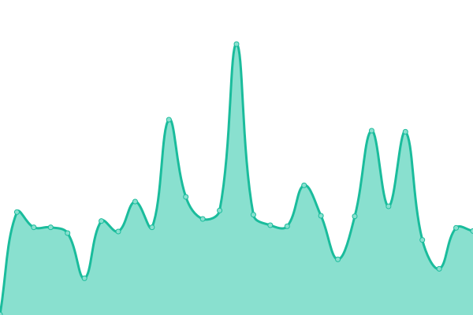 144ms
     
 | 

<a href="https://status.skk.moe/history/hv-monsterdb-data-skk-moe">100.00%</a>
    

|  [mb-lint.skk.moe](https://mb-lint.skk.moe) | 🟩 Up | [mb-lint-skk-moe.yml](https://github.com/SukkaLab/status.skk.moe/commits/HEAD/history/mb-lint-skk-moe.yml) | 

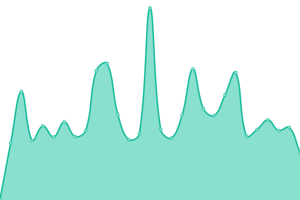 140ms
     
 | 

<a href="https://status.skk.moe/history/mb-lint-skk-moe">100.00%</a>
    

|  [pure-svg-countdown.skk.moe](https://pure-svg-countdown.skk.moe) | 🟩 Up | [pure-svg-countdown-skk-moe.yml](https://github.com/SukkaLab/status.skk.moe/commits/HEAD/history/pure-svg-countdown-skk-moe.yml) | 

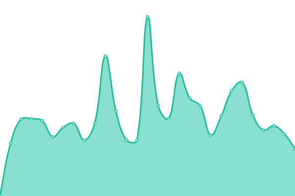 135ms
     
 | 

<a href="https://status.skk.moe/history/pure-svg-countdown-skk-moe">100.00%</a>
    

|  [md2bc.skk.moe](https://md2bc.skk.moe) | 🟩 Up | [md2bc-skk-moe.yml](https://github.com/SukkaLab/status.skk.moe/commits/HEAD/history/md2bc-skk-moe.yml) | 

 133ms
     
 | 

<a href="https://status.skk.moe/history/md2bc-skk-moe">100.00%</a>
    

|  [nali.skk.moe](https://nali.skk.moe) | 🟩 Up | [nali-skk-moe.yml](https://github.com/SukkaLab/status.skk.moe/commits/HEAD/history/nali-skk-moe.yml) | 

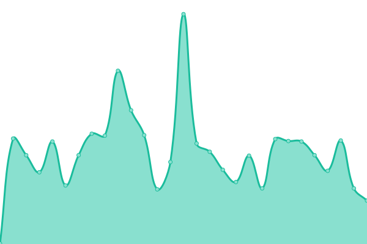 146ms
     
 | 

<a href="https://status.skk.moe/history/nali-skk-moe">100.00%</a>
    

|  [oc.skk.moe](https://oc.skk.moe) | 🟩 Up | [oc-skk-moe.yml](https://github.com/SukkaLab/status.skk.moe/commits/HEAD/history/oc-skk-moe.yml) | 

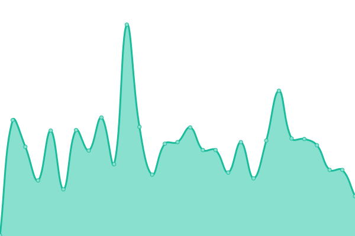 151ms
     
 | 

<a href="https://status.skk.moe/history/oc-skk-moe">100.00%</a>
    

|  [theme-suka.skk.moe](https://theme-suka.skk.moe) | 🟩 Up | [theme-suka-skk-moe.yml](https://github.com/SukkaLab/status.skk.moe/commits/HEAD/history/theme-suka-skk-moe.yml) | 

 135ms
     
 | 

<a href="https://status.skk.moe/history/theme-suka-skk-moe">100.00%</a>
    

|  [api.skk.moe](https://api.skk.moe) | 🟩 Up | [api-skk-moe.yml](https://github.com/SukkaLab/status.skk.moe/commits/HEAD/history/api-skk-moe.yml) | 

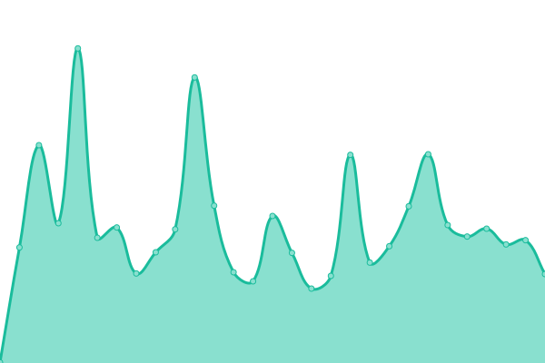 189ms
     
 | 

<a href="https://status.skk.moe/history/api-skk-moe">100.00%</a>
    

|  [qqwry.api.skk.moe](https://qqwry.api.skk.moe) | 🟩 Up | [qqwry-api-skk-moe.yml](https://github.com/SukkaLab/status.skk.moe/commits/HEAD/history/qqwry-api-skk-moe.yml) | 

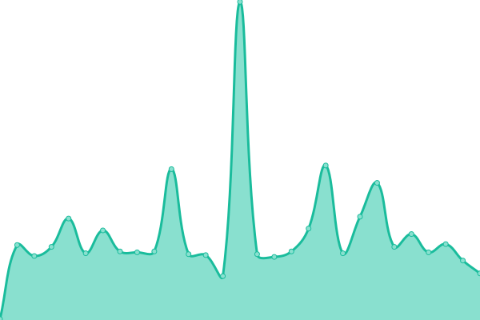 74ms
     
 | 

<a href="https://status.skk.moe/history/qqwry-api-skk-moe">100.00%</a>
    

|  [github-profile-cards.cdn.skk.moe](https://github-profile-cards.cdn.skk.moe) | 🟩 Up | [github-profile-cards-cdn-skk-moe.yml](https://github.com/SukkaLab/status.skk.moe/commits/HEAD/history/github-profile-cards-cdn-skk-moe.yml) | 

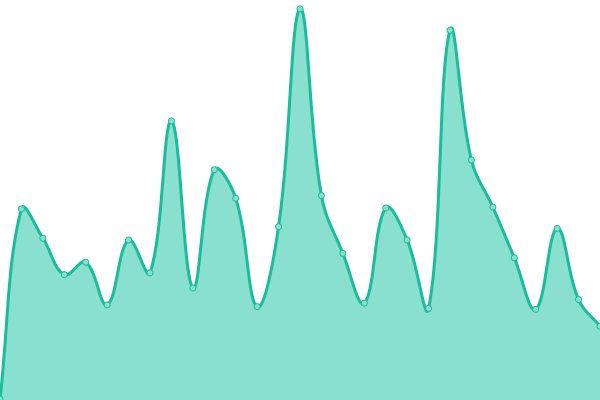 130ms
     
 | 

<a href="https://status.skk.moe/history/github-profile-cards-cdn-skk-moe">100.00%</a>
    

|  [sponsor.cdn.skk.moe](https://sponsor.cdn.skk.moe) | 🟩 Up | [sponsor-cdn-skk-moe.yml](https://github.com/SukkaLab/status.skk.moe/commits/HEAD/history/sponsor-cdn-skk-moe.yml) | 

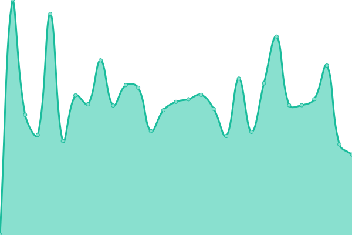 416ms
     
 | 

<a href="https://status.skk.moe/history/sponsor-cdn-skk-moe">100.00%</a>
    

|  [clash.skk.moe](https://clash.skk.moe) | 🟩 Up | [clash-skk-moe.yml](https://github.com/SukkaLab/status.skk.moe/commits/HEAD/history/clash-skk-moe.yml) | 

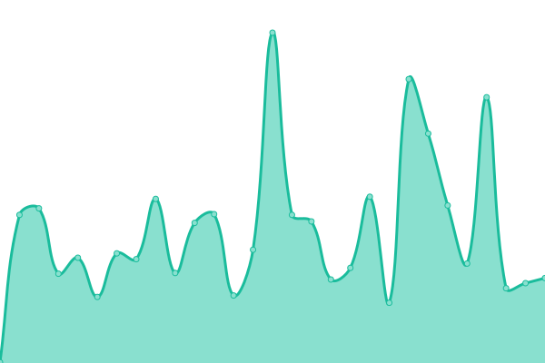 124ms
     
 | 

<a href="https://status.skk.moe/history/clash-skk-moe">100.00%</a>
    

|  [l.skk.moe](https://l.skk.moe) | 🟩 Up | [l-skk-moe.yml](https://github.com/SukkaLab/status.skk.moe/commits/HEAD/history/l-skk-moe.yml) | 

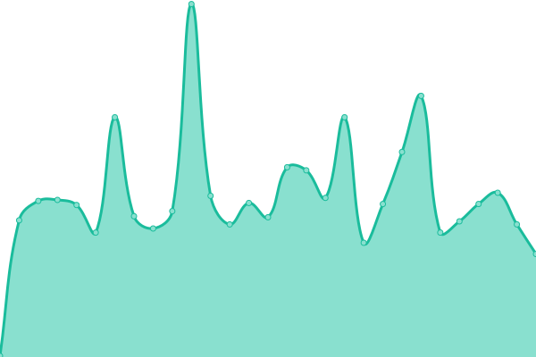 129ms
     
 | 

<a href="https://status.skk.moe/history/l-skk-moe">100.00%</a>
    

|  [share.skk.moe](https://share.skk.moe) | 🟩 Up | [share-skk-moe.yml](https://github.com/SukkaLab/status.skk.moe/commits/HEAD/history/share-skk-moe.yml) | 

 174ms
     
 | 

<a href="https://status.skk.moe/history/share-skk-moe">100.00%</a>
    

|  [shot.skk.moe](https://shot.skk.moe) | 🟩 Up | [shot-skk-moe.yml](https://github.com/SukkaLab/status.skk.moe/commits/HEAD/history/shot-skk-moe.yml) | 

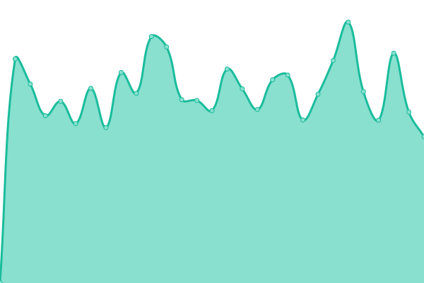 575ms
     
 | 

<a href="https://status.skk.moe/history/shot-skk-moe">100.00%</a>
    

|  [d.skk.moe](https://d.skk.moe) | 🟩 Up | [d-skk-moe.yml](https://github.com/SukkaLab/status.skk.moe/commits/HEAD/history/d-skk-moe.yml) | 

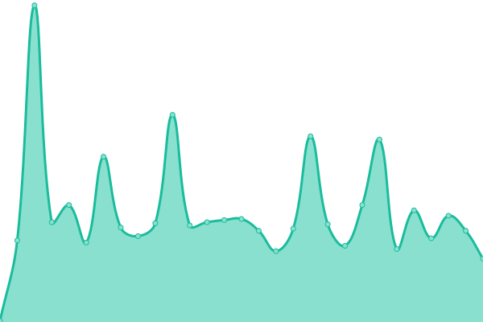 61ms
     
 | 

<a href="https://status.skk.moe/history/d-skk-moe">100.00%</a>
    

<!--end: status pages-->

[**Visit our status website →**](https://status.skk.moe)

## 📄 License

- Powered by: [Upptime](https://github.com/upptime/upptime)
- Code: [MIT](./LICENSE) © [Sukka's Lab](https://lab.skk.moe)
- Data in the `./history` directory: [Open Database License](https://opendatacommons.org/licenses/odbl/1-0/)
